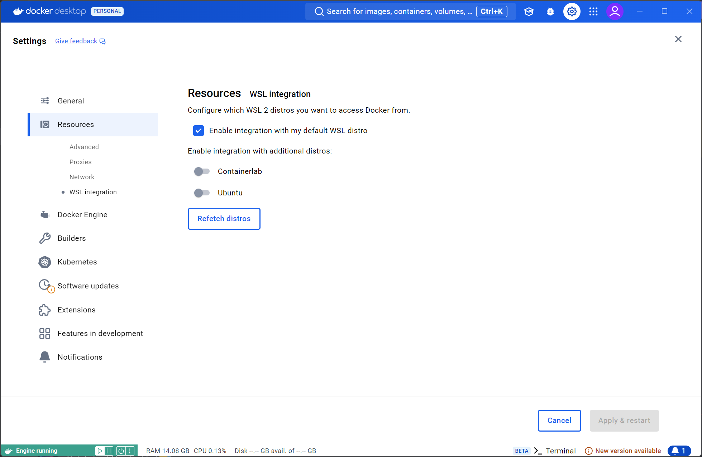
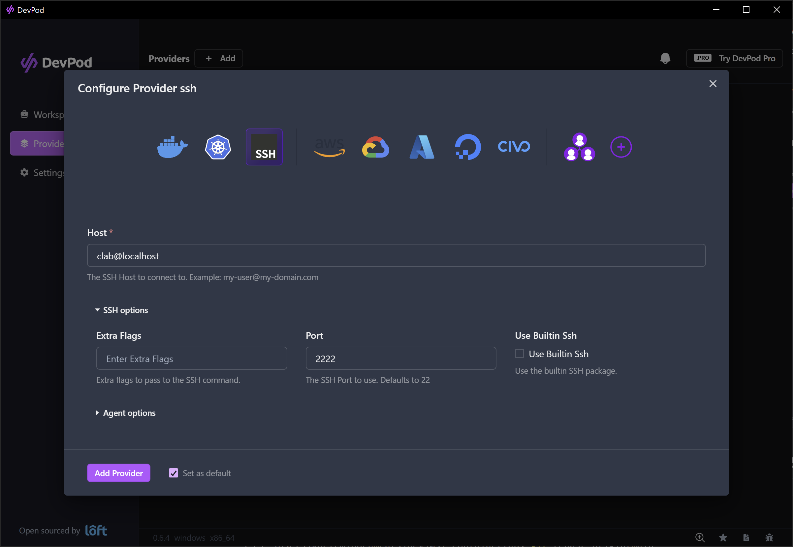

# Containerlab WSL

A WSL distribution designed for easy 'plug and play' usage with [Containerlab](https://containerlab.dev).

> [!IMPORTANT]
> WSL 2.4.4 is required to use this distribution. It is currently in 
> pre-release, meaning you must manually install it.
>
> [Download](https://github.com/microsoft/WSL/releases/tag/2.4.4)


|   **OS**   | **Supported** | **VM-based NOSes** |
|:----------:|---------------|--------------------|
| Windows 10 |      Yes      |         No         |
| Windows 11 |      Yes      |         Yes        |

We recommend using Windows Terminal for the best experience:
- Windows 11 users: Windows Terminal is installed by default.
- Windows 10 users: Download Windows Terminal from the [Microsoft Store](https://aka.ms/terminal).

# Quick start

**Ensure WSL2.4.4 or newer is installed.**

- Download the `.wsl` file from the [releases page](https://github.com/kaelemc/wsl-clab/releases/latest).
- Double click the `.wsl` file to install.
- Open 'Containerlab' from the start menu, or execute `wsl -d Containerlab`
- Complete the interactive shell selection.
- If you have Docker Desktop installed. See [Docker Desktop](#docker-desktop).
- Done! you can start labbing. (see [DevPod](#devpod) for a great way to lab).

>[!NOTE]
> Default credentials are `clab:clab`

# WSL installation

This distro makes use of WSL2, which requires that virtualization is enabled in your UEFI/BIOS. 

This may appear as something called 'SVM (AMD-V)' or 'Intel VT-x' depending on your processor.

### Windows 11

Open powershell and type:

```powershell
wsl --install
```

Restart your PC, and WSL2 should be installed.

### Windows 10

>[!TIP]
> Newer versions of Windows 10 allow usage of `wsl --install`, just like with Windows 11.

**Instructions are from ['Manual installation steps for older versions of WSL'.](https://learn.microsoft.com/en-us/windows/wsl/install-manual)**

Open an elevated powershell window (as administrator) and paste the following two commands:

```powershell
dism.exe /online /enable-feature /featurename:Microsoft-Windows-Subsystem-Linux /all /norestart
```

```powershell
dism.exe /online /enable-feature /featurename:VirtualMachinePlatform /all /norestart
```

At this point restart your computer. After it has rebooted download the latest WSL2 kernel. [Download link](https://wslstorestorage.blob.core.windows.net/wslblob/wsl_update_x64.msi).

Follow the installation wizard. After completion finally set WSL2 as the default version of WSL.

In powershell or command prompt paste the following:

```powershell
wsl --set-default-version 2
```

## Version check

Run `wsl --version` in powershell or command prompt to ensure WSL2 is enabled. The WSL version number should be 2.4.4.0 or higher.

```powershell
PS C:\Users\Kaelem> wsl --version
WSL version: 2.4.4.0
Kernel version: 5.15.167.4-1
WSLg version: 1.0.65
MSRDC version: 1.2.5620
Direct3D version: 1.611.1-81528511
DXCore version: 10.0.26100.1-240331-1435.ge-release
Windows version: 10.0.19044.5131
```

# Distro installation

**Ensure WSL is enabled and you have WSL 2.4.4 or newer. See the [version check](#version-check) instructions.**


1. Download the `.wsl` file from the [latest release](https://github.com/kaelemc/wsl-clab/releases/latest).

2. Double click the `.wsl` file. This will install the distribution.

    > You may see an error that nested virtualization is not supported. See [vrnetlab](#vrnetlab-nested-virtualization).

3. From the start menu you can launch the distribution from a new 'Containerlab' shortcut which has been added. 

    or in powershell/cmd you can execute:

    ```powershell
    wsl -d Containerlab
    ```

4. On first launch you will be presented with an interactive menu to select what shell and prompt you would like. 

    This menu will give you options of `zsh`, `bash` (with a fancy two-line prompt) or `bash` with the default prompt.

    You will also be presented with the choice to have the Fira Code [nerd font](https://www.nerdfonts.com/font-downloads) automatically installed on your system. **We recommend you install this font (especially if using `zsh` as your shell of choice)**.

    Finally at the end SSH keys will be copied from your Windows host into Containerlab WSL to enable passwordless SSH. This is an integral step for [DevPod](#devpod) usage.

    If no SSH keys are found on your machine, an RSA keypair will be automatically generated.

    To run the setup again, execute `/etc/oobe.sh` inside Containerlab WSL.

> [!IMPORTANT]
> After installation, close and reopen Windows Terminal to ensure 
> proper font rendering and appearance settings have been applied 
> correctly. 
> 
> This step is necessary for the terminal to recognize and use the
> newly installed WSL distribution's display configurations.

5. You can open Containerlab WSL in the following ways:

    - From the profile in Windows Terminal (recommended).
    - From the shortcut in the start menu.
    - Executing `wsl -d Containerlab` in powershell or command prompt.

> [!NOTE]
> Opening WSL via the shortcut or `wsl -d Containerlab` will not
> open in our custom Windows Terminal profile. The customised
> appearance settings will not be functional in this case.

# vrnetlab (Nested virtualization)

> [!IMPORTANT]
> This feature is only supported on Windows 11.

You can run [vrnetlab (VM-based)](https://github.com/hellt/vrnetlab) nodes on top of WSL2 and use them in containerlab. Containerlab WSL is already configured so that nested virtualisation is enabled on the distro side.

To use vrnetlab nodes on Containerlab WSL you must <u>ensure that nested virtualization is enabled globally in WSL</u>. 

- You can do this by opening the *'WSL Settings'* app, going to the *'Optional features'* tab and ensuring *'Enable nested virtualization'* is enabled.
  
  If you don't get any errors during installation or distro bootup saying that 'Nested virtualization is not supported on this machine.' You should be good to go.

See the [containerlab user manual](https://containerlab.dev/manual/vrnetlab/) for more information about vrnetlab.

# Performance tuning

WSL2 runs as a VM. By default allocated resources are:

| **Resource** | **Default value**    | **Description**                                                                                                     |
|:------------:|----------------------|---------------------------------------------------------------------------------------------------------------------|
| vCPU         | Logical thread count |               If your processor has 8 cores and 16 threads, WSL2 will assign 16 threads to the WSL VM               |
| RAM          | 50% of system memory |                    If you have 32Gb of RAM on your system, WSL will allocate 16Gb to the WSL VM.                    |
| Disk         | 1Tb                  | Regardless of disk size, the WSL VM will have a VHD with a maximum size of 1Tb. The disk is thin/sparse provisioned. |

Despite the fairly generous resource allocation by default. WSL2 will not use 100% of the assigned resources.

# Docker desktop

If you have Docker desktop installed. You **must** ensure the integration with the Containerlab WSL distro is disabled, otherwise Containerlab will not work inside Containerlab WSL.

1. Open Docker Desktop window and go to settings (gear icon on the title bar)
2. Under the 'Resources tab, enter the 'WSL integration' page
3. Ensure 'Containerlab' has integration disabled



# DevPod

[DevPod](https://devpod.sh/) is an awesome tool which can let us easily run labs which take advantage of Devcontainers, which overall can give a 'one-click' lab experience. It's like running the codespaces labs but on your local machine.

Check out [this video](https://www.youtube.com/watch?v=ceDrFx2K3jE) for more info.

Containerlab WSL was designed to support this lab experience out of the box. Just remember the following consideration:

- When using DevPod, ensure Containerlab WSL is started (it does **not** automatically launch on Windows startup), you should leave the terminal window with Containerlab WSL open in the background.

A one-time configuration step is required. You must setup a provider in DevPod. For Containerlab WSL, create the **SSH** provider with the following values:

| Field | Value            |
|-------|------------------|
| Host  | `clab@localhost` |
| Port  | `2222`           |

You can leave the other settings as the default values. See the screenshot below.

After configuring the provider, you are done! You can now use one-click labs you see with the DevPod button, or configure the lab workspaces yourself.



# Developers

Development should be performed from another WSL distribution.

Clone the repository and build using the build script (you may have to `chmod +x` the script)

```bash
./build.sh
```

This will place `clab.wsl` in `C:\temp`. Doubleclick to install the distribution.

## Manual steps

1. From inside a WSL distro Build the container:

```bash
 docker build . --tag ghcr.io/kaelemc/clab-wsl-debian
```

2. Run it and export the filesystem to a `.wsl.` file:

```bash
docker run -t --name wsl_export ghcr.io/kaelemc/clab-wsl-debian ls /
docker export wsl_export > /mnt/c/temp/clab.wsl
```

> Create the 'temp' directory on your C: drive if it doesn't exist.

Remove the container to ease rebuilding:

```bash
docker rm wsl_export
```

3. Use it
  
In your windows filesystem at `C:\temp` should be a file `clab.wsl`, double click to install. or use:

```powershell
wsl --install --from-file clab.wsl
```

# Uninstallation

Uninstall Containerlab WSL using the following command in powershell/command prompt:

```powershell
wsl --unregister Containerlab
```

Ensure uninstallation by checking installed distros:

```powershell
wsl -l -v
```

# Reference material

https://learn.microsoft.com/en-us/windows/wsl/use-custom-distro#export-the-tar-from-a-container
https://learn.microsoft.com/en-us/windows/wsl/build-custom-distro
